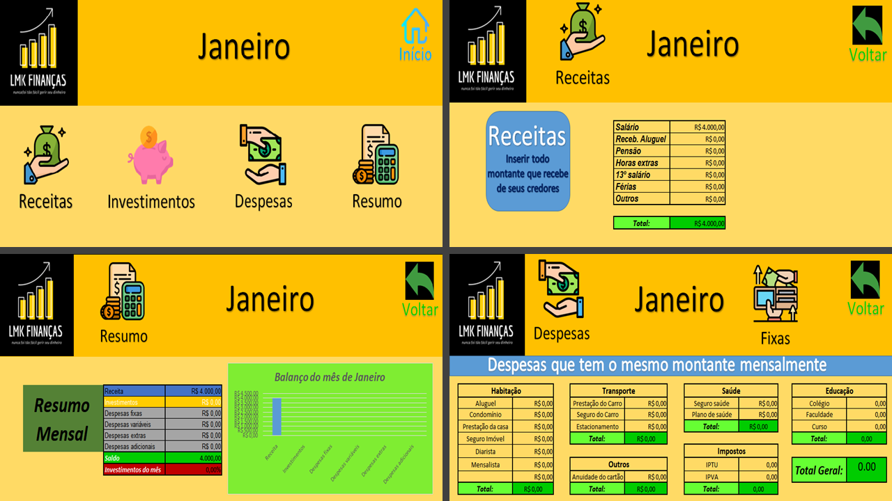

**_Planilha automática no Excel_**

Acesse a página 🖥 -> <a href="https://lmkfinancas-planilha.netlify.app">lmkfinancas-planilha.netlify.app</a> 

 
 
 
 

Em parceria com a LMK Finanças, desenvolvi essa página web utilizado HTML, CSS e JavaScript para que elas pudessem apresentar seu Trabalho de conclusão de curso e garantir seu diploma. Foi meu primeiro serviço como desenvolvedor Front-end e aprendi bastante com a oportunidade.
 

<h1>Preview da página</h1>
 

 
 

 

<h1>Como funciona ?</h1>
 

