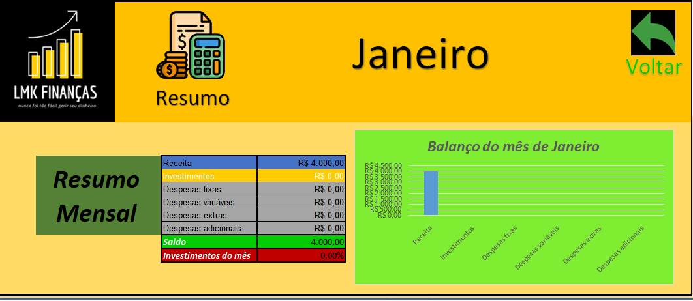
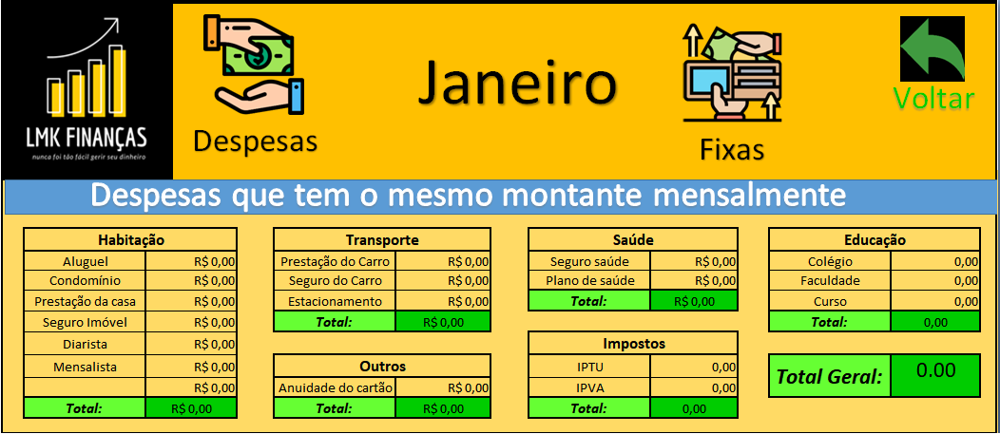
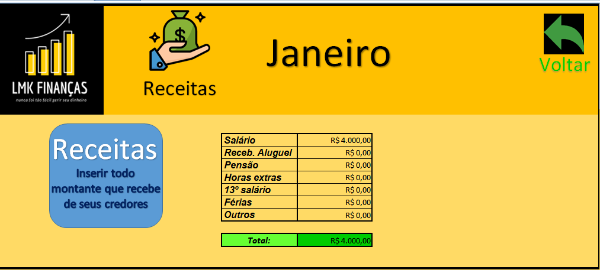

**_Planilha automática no Excel_**

Acesse o site 🖥 -> <a href="https://lmkfinancas-planilha.netlify.app">lmkfinancas-planilha.netlify.app</a> 

 
 
 
 

<h1>Preview do site</h1>
 

 
 

 

<h1>Como funciona ?</h1>
 

